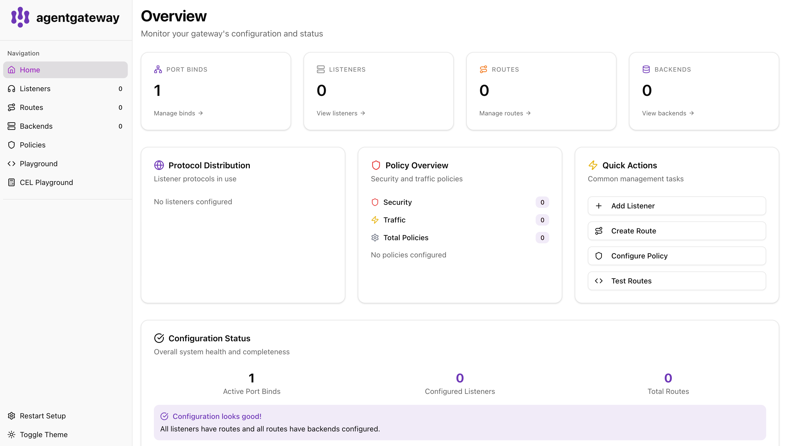
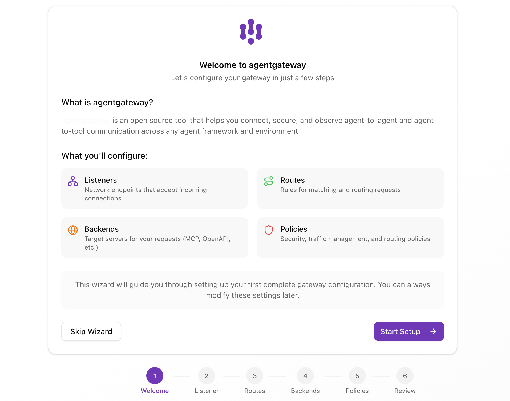

# agentgateway on Railway
[agentgateway](https://agentgateway.dev) is an open source agentic proxy for AI agents and MCP servers. This template deploys agentgateway on [Railway](https://railway.com/?referralCode=alphasec) with the admin UI accessible via a single public port, using [Caddy](https://alphasec.io/how-to-deploy-a-static-website-with-caddy-on-railway) as a reverse proxy to route MCP traffic and the admin interface.

## How it works
 
Caddy listens on Railway's `$PORT` and routes:
- `/` → agentgateway MCP endpoint (port 3000)
- everything else → agentgateway admin UI (port 15000)
 
This works around Railway's single public port constraint while keeping both the MCP endpoint and admin UI accessible.

## Deploy

Deploy on [Railway](https://railway.com/?referralCode=alphasec) using the one-click starter template below.

## Usage
 
Once deployed, open `https://your-app.up.railway.app/ui` to access the admin UI. Configure listeners, routes, and backends from there — changes are written back to `config.yaml` automatically.
 
To connect an MCP client, point it at `https://your-app.up.railway.app/`.
 
## Configuration
 
The template starts with a blank slate — no listeners, routes, or backends. Everything is configured via the UI after deployment.
 
To make static changes, fork this repo, edit `config.yaml` and redeploy. See the agentgateway [configuration docs](https://agentgateway.dev/docs/standalone/latest/configuration/overview/) for the full schema.

